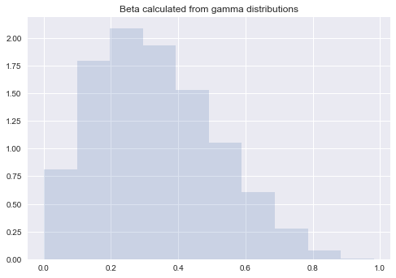
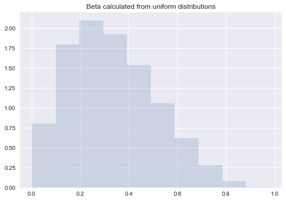
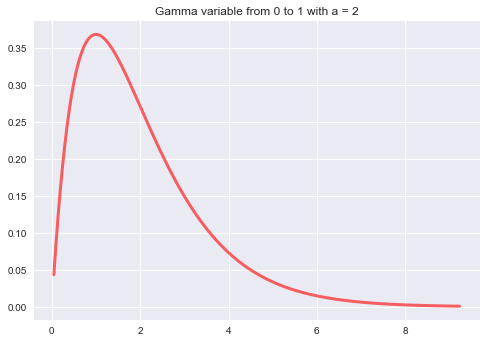
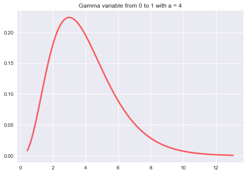
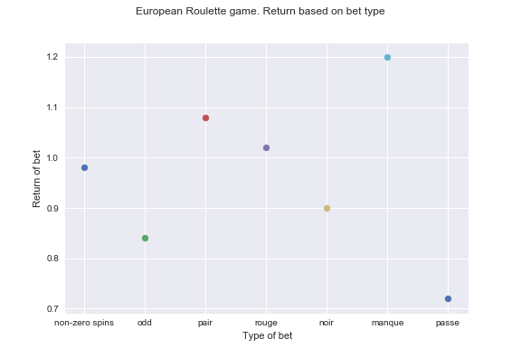

# Probabilistics and simulation projects

### Generation of Beta variable using Uniform and Gamma random variables.

### Theoretical results
 
- Coefficients : a = 2 and b = 4
- Theorical mean is a / (a + b) 
- Expected mean : 0.3333333333333333
- Theoretical variance is a * b / ((a + b) ^ 2 * (a + b + 1)
- Expected variance: 0.031746031746031744
- Expected standard deviation: 0.1781741612749496

### Experimental results (for 1000000 samples)

#### Beta from Gamma:
- Mean: 0.3330981837708488
- Standard deviation: 0.17803841500070075

#### Beta from uniform:
- Mean is 0.33302346791937926
- Standard deviation is 0.17811076031758236

## Histograms 

 
 
 
 
 

### Gamma distributions plots (ppf)
 
 
 
 
 
 
## Roulette simulation

### Monte Carlo simulation for 10000 samples

 
